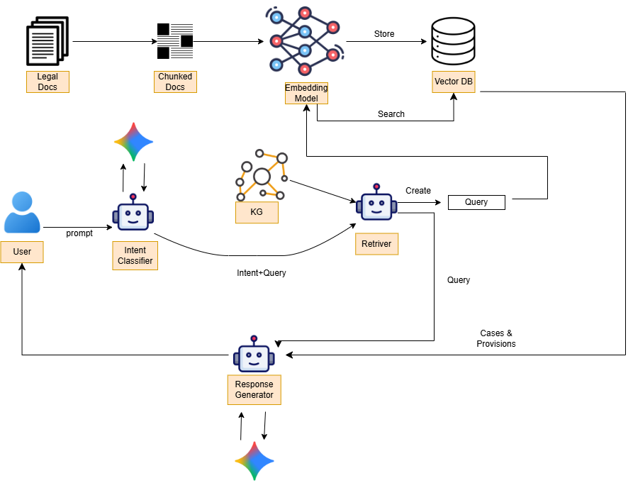

# AI Legal Chain Resolver II

This project implements an AI-based legal question answering system using Retrieval Augmented Generation (RAG) and a Knowledge Graph (KG). The system retrieves relevant sections from legal documents and generates answers grounded in the retrieved context, improving reliability and reducing hallucinations compared to general language models.

The system is designed to help users quickly understand legal information by providing structured answers with references to the relevant legal sections.

## Key Features

- RAG-based legal QA system for retrieving and answering legal queries.
- Knowledge Graph integration to improve query understanding and retrieval.
- Multiple retrieval methods including BM25, FAISS vector search.
- Structured answer generation with references to relevant legal sections.
- Evaluation framework measuring retrieval performance, answer accuracy, hallucination rate, and system performance.

## Architecture Overview

- `code/app.py`: Flask backend serving the UI and API endpoints.
- `code/Agents/*`: Intent classification, retrieval, and response generation logic.
- `code/Tools/*`: Gemini client utilities and retriever helpers.
- `code/static/*`: Frontend UI, streaming display, and citation download flow.
- `code/Data/Acts/*`: Act text and PDF sources used for citations.

## High Level Architecture



## Data Layout

- Act text: `code/Data/Acts/Text/`
- Act PDFs: `code/Data/Acts/PDF/`
- RAG chunks: `code/Data/chunks/`
- Cleaned text: `code/Data/Cleaned/`
- FAISS indexes: `code/Data/Indexes/`

## Folder Structure

```
code/
  Agents/
  Data/
    Acts/
      PDF/
      Text/
    Cleaned/
    Indexes/
  Evaluation/
  Pipelines/
  Tools/
  app.py
```

## Setup

1) Create a `.env` file or export the API key:

```bash
set GEMINI_API_KEY=your_key_here
```

2) Install dependencies:

```bash
pip install -r requirement.txt
```

## How To Run

1) Create and activate a virtual environment, then install dependencies:

```bash
python -m venv code/.venv
code\.venv\Scripts\Activate.ps1
pip install -r requirement.txt
```

2) Run the Flask app:

```bash
python code/app.py
```

Open `http://localhost:5000`.

## How To Add New Data To RAG

1) Put cleaned text files into `code/Data/Cleaned/`.
2) Run `code/Tools/build_faiss.py` to rebuild the FAISS index.

## How To Evaluate

Run the scripts under `code/Evaluation/` for retrieval and QA evaluation.

## API Endpoints

- `POST /api/query`  
  Returns full response JSON with `answer` and `citations`.

- `POST /api/query-stream`  
  Streams the Gemini response as plain text; the UI parses the final JSON.

- `POST /api/citation-pdf`  
  Body: `{ "source": "<source>" }`  
  Downloads `code/Data/Acts/PDF/<source>.pdf` if available.

## Usage Notes

- Citations are grouped by act in the UI; one download button per act.
- Ensure PDF filenames match the `source` field returned by the model.
- Streaming is enabled by default in the UI.

## Tests

Tests and scripts live under `code/Test/` and `code/Tools/`. Run them as needed for your environment.
